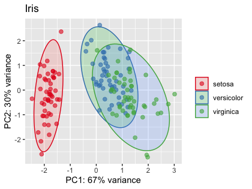

# MD helper functions

Lightweight version of the `MDmisc` R package containing various helper functions for computational genomics research. [Old version](https://github.com/mdozmorov/MDgenomerunner)

## Installation

```
if (!require('devtools')) install.packages('devtools')
devtools::install_github('mdozmorov/MDmisc')
```

## Functions

- `pca_func` - PCA plot with groups wrapped into ellipses. `pca_func(iris[, 1:3], groups = iris$Species, title = "Iris")`



- `ipak` - Unified installer for CRAN, Bioconductor, and GitHub packages. Depreciated, use `BiocManager::install()`
```
# CRAN packages
cranpackages <- c("tidyverse", "data.table", "caret", "e1071", "writexl", "enrichR", "xaringan", "cowplot", "pander", "survminer")
ipak(cranpackages, repository = "CRAN")
# Bioconductor
biocpackages <- c("limma", "edgeR", "SingleCellExperiment", "clusterProfiler")
ipak(biocpackages, repository = "Bioconductor")
# GitHub
githubpackages <- c("nanxstats/ggsci", "slowkow/ggrepel", "mdozmorov/MDtemplate", "mdozmorov/MDmisc")
ipak(githubpackages, repository = "github")
# RnBeads special installation of many genomics packages
source("http://rnbeads.org/data/install.R")
```

- `save_res` - A function to save a data frame or a matrix into an Excel file. Legacy function for compatibility with old code. Depreciated, use `writexl::write_xlsx()`
